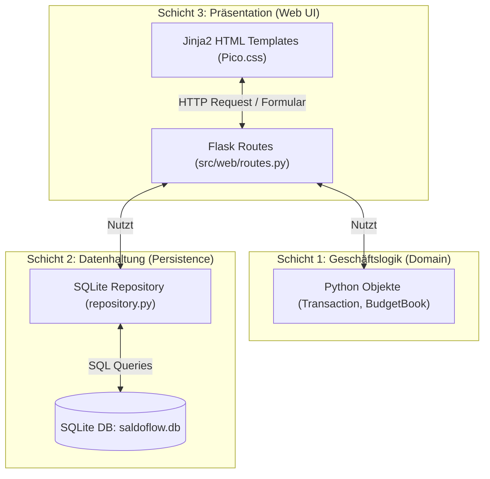
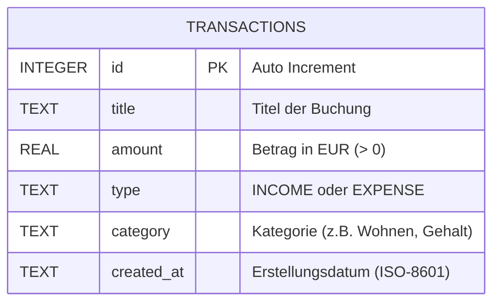
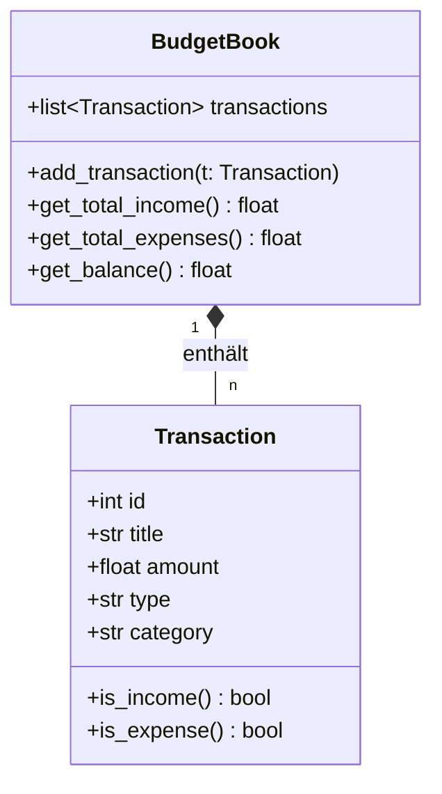
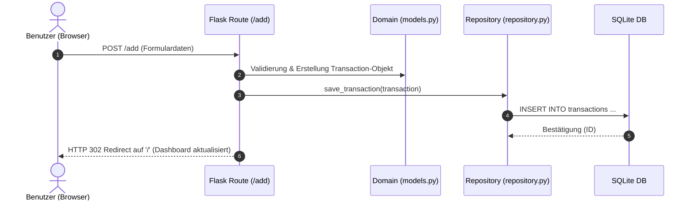

# 🏗 Architektur & Entwurf: SaldoFlow

**Projekt:** SaldoFlow (Modulares Haushaltsbuch – AnwP)  
**Version:** 1.0 (Sprint 1)  
**Status:** In Erstellung / Begleitende Entwicklungsdokumentation  

---

## 📐 1. Gesamtarchitektur (3-Schichten-Modell)

SaldoFlow basiert auf einer klaren **3-Schichten-Architektur** (Clean Architecture), um Geschäftslogik, Datenhaltung und Benutzeroberfläche strikt voneinander zu entkoppeln.



---

## 🗄 2. Datenbankschema (Persistence Layer)

Die Datenhaltung erfolgt in einer lokalen **SQLite-Datenbank** (`saldoflow.db`). Für Sprint 1 wird eine zentrale Tabelle `transactions` verwendet.



### DDL Schema (`src/persistence/schema.sql`)
```sql
CREATE TABLE IF NOT EXISTS transactions (
    id INTEGER PRIMARY KEY AUTOINCREMENT,
    title TEXT NOT NULL,
    amount REAL NOT NULL,
    type TEXT NOT NULL CHECK(type IN ('INCOME', 'EXPENSE')),
    category TEXT NOT NULL,
    created_at TIMESTAMP DEFAULT CURRENT_TIMESTAMP
);
```

---

## 🧩 3. Domänenmodell (Domain Layer)

Die Geschäftslogik ist unabhängig von Flask und SQLite in reinen Python-Klassen kapselt (`src/domain/models.py`).



---

## 🌐 4. Web & Routing (Presentation Layer)

Der Webserver verwendet das **Application Factory Pattern** (`src/web/__init__.py`).

### Endpunkte (Routes):
| HTTP Methode | Pfad | Beschreibung | Beteiligte Komponenten |
| :--- | :--- | :--- | :--- |
| `GET` | `/` | Zeigt das Dashboard mit Saldo-Berechnung & Buchungstabelle | `routes.py`, `index.html`, `repository.py` |
| `POST` | `/add` | Verarbeitet das Formular zur Erfassung neuer Transaktionen | `routes.py`, `models.py`, `repository.py` |
| `POST` | `/delete/<id>` | Löscht eine bestimmte Transaktion | `routes.py`, `repository.py` |

---

## 🔄 5. Datenfluss bei einer Buchung (Beispiel: Transaktion hinzufügen)



---

## 📝 6. Zuständigkeiten im Entwicklerteam

* **Entwickler A:** Pflege & Tests von Kap. 3 (`src/domain/models.py`)
* **Entwickler B:** Pflege & Tests von Kap. 2 (`src/persistence/schema.sql`, `repository.py`)
* **Entwickler C:** Gestaltung von Kap. 4 UI (`src/web/templates/base.html`, `index.html`)
* **Teamleiter (Du):** Gesamtarchitektur, Kap. 4 Routes (`src/web/routes.py`), Integration & Doku-Schirmherrschaft
